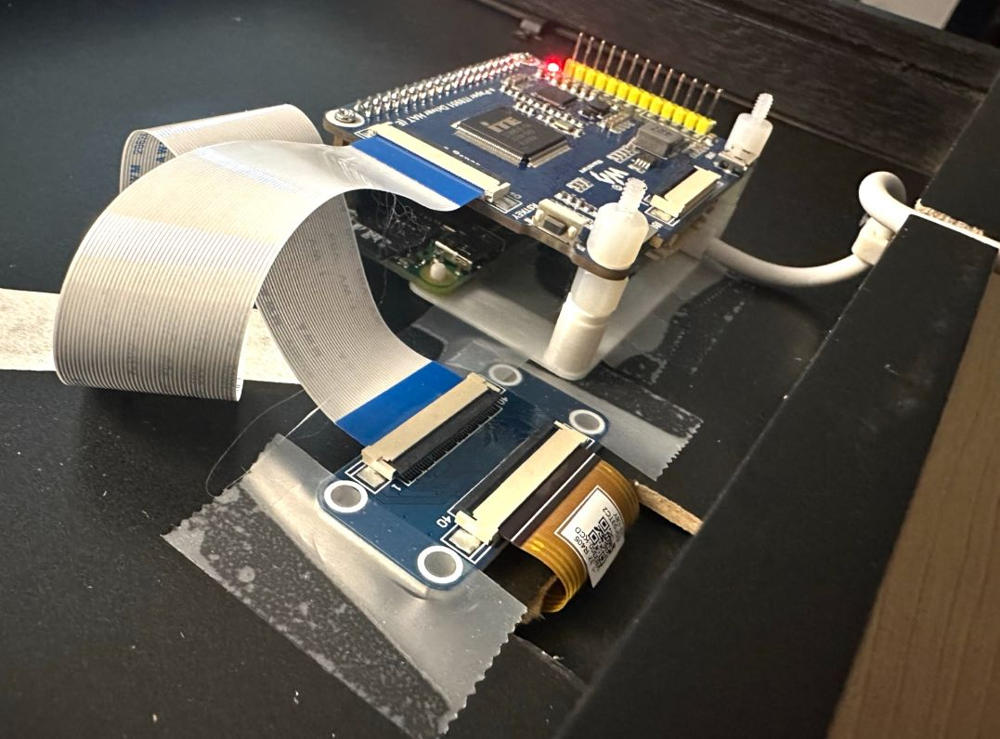

# Luna

e-paper moon clock

Shows the phase, current sky position, and rise & set times of the Moon.


Powered by a Raspberry Pi with a Waveshare e-paper display.

## Build and install

Depends on a few packages: `sudo apt-get install autoconf imagemagick python3-venv fontconfig fonts-liberation fonts-urw-base35`

Clone the source respository and run `git submodule update --init` to fetch the image library

> The images are about 18GB.  Fetching the submodule also requires about 18GB of git repository overhead.
> To just get the images, without a repository, run `./loader/images/fetch-images.sh` instead of `git submodule`.

To compile luna: `make`

> Compilation is entirely local to the current directory

Set your latitude and longitude (positive is north/east):

```
echo XX.XX > config/latitude
echo YY.YY > config/longitude
```

To install the luna systemd service and start the process every five minutes: `VCOM=YOUR_VCOM make install`

`YOUR_VCOM` is the vcom value from your screen's cable, a small negative number like `-1.37`.
See [the waveshare docs](https://www.waveshare.com/wiki/10.3inch_e-Paper_HAT#Use_the_correct_VCOM_value)

> Systemd creates a symlink to `systemd/luna.service` in the current directory,
> so relocate this code to its permanent home before `make install`.

Luna uses `/var/tmp/luna` as scratch space.
This can be safely cleared at any time the process is not actively running.


## Development

The various components can be developed independently:

- `bcm2835-1.71/`: Broadcom BCM 2835 library from http://www.airspayce.com/mikem/bcm2835/
    - required by the waveshare code
    - build with `make bcm2835`
- `waveshare/`: C code based on Waveshare's RPi library at https://github.com/waveshare/IT8951-ePaper/tree/master/Raspberry
    - builds `bin/epd`, which displays a bitmap on the e-paper display
    - build with `make waveshare` after building `bcm2835` at least once
- `loader/`: Python code that prepares the moon image for display and optionally displays it
    - produces `/var/tmp/luna/tmp-display.bmp` for display
    - hard-coded display size and location are here
    - requires a virtualenv that is built by `make loader`
    - `images/`: library of images and ephemeris data from NASA
- `systemd/`: systemd unit for running the loader
    - installs a service named `luna`
    - see its logs with `sudo journalctl -eu luna`
    - `make uninstall` to stop and remove the service

To produce the image `/var/tmp/luna/tmp-display.bmp` that will be displayed,
run `./loader/main.py` (after running `make` at least once).
You do not need to re-`make` after changes to `loader`'s Python files;
just re-run `main.py`.

The image produced by `main.py` includes some debugging info that is covered by the frame:


## Frame and mount

I designed and tested Luna with Raspberry Pi Zero WH & [Waveshare 10.3", 16-grays, 1872x1404px display](https://www.waveshare.com/10.3inch-e-paper.htm).
Other Raspberry Pi and display models should work, with slight modifications (see below), but are not tested -- YMMV.

The Raspberry Pi is flashed with Raspberry Pi OS,
and configured with SSH access and Wifi at imaging time.

I mounted Luna for display in a 10"x10" frame ([Blick 18862-2010](https://www.dickblick.com/items/blick-wood-gallery-frame-black-10-x-10-/)),
matted with black museum board ([Blick 13447-2051](https://www.dickblick.com/items/super-black-presentation-and-mounting-board-15-x-20-14-ply-black/)).
The mat is 9-3/4" square, with a 6-1/8" diameter circle laser-cut in its center.
The display is taped to the back of the mat,
with the ribbon cable through a slot cut in the frame's backing.
The Raspberry Pi and e-ink driver board are mounted on a [3d-printed bracket](frame/luna-board-mount.stl) affixed to the backing,
with standard standoffs and screws.



## Limitations and TODOs

- The e-ink display has two parameters that are hard-coded to the 10.3" display; change accordingly to your display:
    - `DISPLAY_DIMENSIONS_PX` in `loader/main.py`
    - Screen mode argument to `epd` in `systemd/luna.service.tmpl` (`ExecStart` line)
